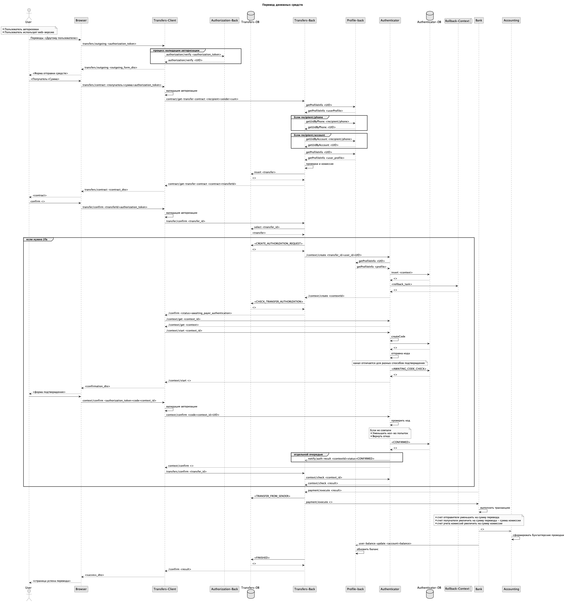

= Описание процесса перевода
:toc: left
:toc-title: Содержание
:toclevels: 3
:sectnums:

== Общие сведения

Решение описывает процесс перевода средств между пользователями одного банка.
Решение описывает процесс для desktop-клиента.

Может быть переиспользовано для мобильного клиента при условии создания между компонентом-оркестратором процесса и клиентом прослойки api-gateway, реализующей аутентифкацию и авторизацию экземпляра мобильного приложения

== Требования
=== Функциональные требования
. Пользователь должен иметь возможность отправить средсва со своего счета на другой счет в банке
. Система должна предоставить пользователю интерфейс для указания получателя и суммы перевода
    .. Пользователь должен иметь возможность указать в качестве идентификатора получателя номер счета получателя в банке
    .. Пользователь должен иметь возможность указать в качестве идентификатора получателя номер телефона получателя
        ... Система должна определить наличие получателя с указанным идентификатором и выбрать последний активный счет получателя с указанным номером телефона
. Система должна отображать пользователю комиссию, которую удержит из суммы перевода до фактического подтверждения пользователем операции движения средств
. Система должна проводить операцию перевода с той комиссией, которую отобразили пользователю (комиссия не может измениться между подтверждением и фактическим движением средств)
. Система должна осуществлять проверки возможности перевода между счетам до фактического распоряжения пользователя на движение средств
    .. В случае невозможности осуществления перевода по указанным реквизитам на указанную сумму система должна уведомить пользователя об ошибке
. Система должна запрашивать подтверждение операции вторым фактором, если это предусмотрено настройками аккаунта отправителя
. (Для смс подтверждения) Система должна отправлять смс с проверочным одноразовым четырехзначным кодом на номер телефона, привязанный к учетной записи отправителя
. Пользователь должен иметь возможность запросить повторную отправку кода спустя 60 секунд после отправки
. Система должна предоставить пользователю возможность запрашивать повторную отправку кода не более 5-и раз для одной сессии подтверждения
. Система не должна проводить операцию, если подтверждение вторым фактором не было выполнено по причине исчерпания количества попыток ввода кода
. Система должна нотифицировать отправителя и получателя о списании и зачислении средств по счетам (если нотификация предусмотрена настройками учетной записи отправителя и получателя)

=== Нефункциональные требования

. Данные о переводах должны храниться в течение 5-и лет с момента совершения перевода
. Данные о подтверждении операции должны храниться в течение 5-лет с момента подтверждения операции
. Все вызовы процесса перевода должны логироваться и содержать сквозной идентификатор трассировки
. Количественные показатели успешных и неуспешных переводов должны отправляться в службу мониторинга для построения графиков

=== Принятые предусловия

*Авторизация*

- Считаем, что пользователь авторизован в системе. Результатом авторизации является выставленная в Браузер авторизационная кука, содержащая уникальный идентификатор сессии авторизации в формате UUID.
- Внутри сессии авторизации есть указание на идентификатор пользователя (UID)
- Сессия автопродляемая: каждый запрос валиадции авторизационной сессии увеличивает время жизни сессии на 5 минут

*Клиентская часть*

- рассматривается процесс для web сценариев
- сценарий для мобильных устройств может быть реализован с использованием дополнительной прослойки api-gateway для разыменования авторизаций экземпляров мобильных приложений

*Допущения*

- У пользователя-отправителя один счет в системе банка
- у пользователя-отправителя настроено подтверждение операций с помощью sms

== Пользовательский сценарий

. Пользователь инициирует отправку средств другому пользователю
    .. переходит в раздел "переводы"
. Система отображает интерфейс указания получателя перевода
. Пользователь указывает данные Получателя перевода (кому отправляет деньги)
. Система осуществляет проверку наличия счета получателя
    .. Если счет для указанного получателя существует
        ... Система отображает интерфейс указания суммы перевода
    .. Если счета для указанного номера не существует
        ... Система отображает интерфейс ошибки
. Пользователь указывает сумму перевода
. Система определяет комиссию за перевод
. Система отображает пользователю форму подтверждения перевода:
    .. Данные отправителя маскируются до последних цифр
    .. Данные получателя маскируются до последних цифр
    .. Сумма перевода
    .. Комиссия за перевод
        ... _(i)_ Комиссию удерживаем из суммы перевода. Для комиссии "сверху" пересчитываем контракт с шага "Система отображает интерфейс указания суммы перевода"
. Пользователь подтверждает осуществление перевода на зафиксированных на форме перевода условиях
    .. если пользователь отказывается - конец сценария
. Система начинает процесс перевода
. Система проверяет возможность осуществления перевода
    .. Средства в указанном объеме (с учетом комиссии) могут быть списаны со счета отправителя
    .. Средства в указанном объеме могут быть зачислены на счет получателя
    .. ЕСЛИ одна из проверок завершилась не успехом
        ... Система отображает пользователю ошибку содержания "перевод не может быть выполнен"
. Система отображает пользователю интерфейс подтверждения операции вторым фактором
    .. В зависимости от настроек счета (учетной записи пользователя) это может быть
        ... ввод одноразового кода из sms (в сценарии рассматриваем этот вариант)
        ... подтверждение в мобильном приложении
. Система отправляет одноразовый код на устройство пользователя
. Пользователь вводит код и инициирует отправку формы
. Система проверяет соответствие введенного кода отправленному
    .. Если код введен верно
        ... Система проводит операцию перевода
        ... Система отображает пользователю результат перевода
        ... Система отправляет (если настройками учетной записи предусмотрено) отправителю уведомление о списании средств со счета
        ... Система отправляет (если настройками учетной записи предусмотрено) получателю уведомление о зачислении средств на счет
    .. Если код введен не верно
        ... Система отображает ошибку содержания "Код введен не верно"
        ... Система отображает оставшееся кол-во попыток ввода одноразового кода
        ... Система отображает форму ввода одноразового кода

== Компоненты и зоны ответственности

.**Схема компонентов решения**
[%collapsible]
====
link:diagrams/components.puml[исходник]

====

|===
|*Компонент*|*Зона ответственности*
|Transfers-Сlient|Front-end приложение обеспечивающее взаимодействие пользователя с сервисом переводов
|Authorization-Back|Back-end приложение, обеспечивающее авторизацию пользователей системы
|Transfers-Back|Back-end приложение-оркестратор, выполняющее функцию управление процессом перевода средств
|Transfers-DB|База данных сервиса Transfers-Back
|Profile-back|Back-end сервис хранения данных и настроек пользователей системы
|Authenticator| Back-end сервис-оркестратор процесса подтверждения действий пользователя вторым фактором
|Authenticator-DB| База данных сервиса Authenticator
|Bank| Back-end сервис, обеспечивающий хранение актуальных данных о счетах пользователей, а так же реализующий логику изменения состояния этих счетов
|Accounting| Back-end сервис, реализующий логику бухгалтерского учета движения средств между счетами пользователей
|===

== Технический сценарий

.Схема процесса
[%collapsible]
====
link:diagrams/process.puml[исходник]

====

=== Создание перевода

. *Пользователь* инициирует проведение перевода другому пользователю банка
    .. _переход в раздел "переводы"-> "другому пользователю банка"_
. *Бразуер*  делает запрос на url вида transfers/outgoing
    .. В заголовке запроса передается (если выставлена) авторизационная кука пользователя
. Запрос приземляется в *nginx* и балансируется на приложение *transfers-client*
. *transfers-client* валидирует авторизацию пользователя об auth-back сервис
    .. метод authorization/verify - проверяет состояние авторизационной сессии пользователя
+
.Пример запроса
[%collapsible]
====
[source, json]
----
{
  "authorization_token": "AEmaoBLAIAb5AAAAXJ61NXgTUxrvepjWyWTZWddV9qKXav01lp3ESumhBVCQ8jFdOmjke7qgTVEJRVEPyEF_DnQ"
}
----
|====
|*Поле*|*Тип*|*Обязательность*|*Значение*
|authorization_token|string|Обязательное|Авторизационный токен - идентификатор сессии авторизации пользователя. Выставляется в куку authorization
|===
====
+
. *auth-back* возвращает результат проверки сессии
    .. в случае валидной сессии
+
.Пример для валидной авторизации
[%collapsible]
====
[source, json]
----

{
  "result": {
    "success": {
      "uid": 123
    }
  },
  "status": "success"
}

----
|====
|*Поле*|*Тип*|*Обязательность*|*Значение*
|status|string(enum)|Обязательное|Системный статус обработки запроса. Принимает значения success/progress/error
|result|object|Не обязательное| (объект отсутствует при общем системном статусе progress) Результат выполнения авторизации. Включает данные успешной и неуспешной обработки. В случае не успещной обработки в объекте передается информация об ошибках
|success|object|Не обязательное| (объект отсутствует при неуспешном выполнении авторизации) Данные об успешной авторизации пользователя
|uid|string|Обязательное| Уникальный идентификатор профиля авторизованного пользователя
|===
====
+
    .. в случае невалидной сессии
+
.Пример для невалидной авторизации
[%collapsible]
====
[source, json]
----

{
  "result": {
    "fail": {
      "error_code": "Revoked"
    }
  },
  "status": "success"
}

----
|====
|*Поле*|*Тип*|*Обязательность*|*Значение*
|status|string(enum)|Обязательное|Системный статус обработки запроса. Принимает значения success/progress/error
|result|object|Не обязательное| (объект отсутствует при общем системном статусе progress) Результат выполнения авторизации. Включает данные успешной и не успешной обработки. В случае не успешной обработки в объекте передается информация об ошибках
|fail|object|Не обязательное| (объект отсутствует при успешном выполнении авторизации) Данные о не успешной обработке авторизации пользователя
|error_code|string|Обязательное| код ошибки авторизации
|===
====
+
. *transfers-client* разбирает ответ
    .. _В случае неуспешной обработки авторизации возвращает ошибку. Начнется сценарий авторизации_
. *transfers-client* формирует DTO формы отправки средств и возвращает в *Браузер*
. *Браузер** отображает форму отправки средств *Пользователю*

. *Пользователь* указывает данные получателя (телефон или номер счета) и сумму перевода
    .. Валидация данных получателя на уровне поля recipient (маска телефона, маска номера счета)
. Пользователь инициирует отправку формы
    .. [Примечание] _Принимаем, что у отправителя один счет в системе_

=== Запрос контракта перевода

NOTE: Контракт перевода - сущность, в которой зафиксированы данные перевода: отправитель, получатель, сумма, комиссия. Контракт выполняет 2 основных функции: уведомляет пользователя о комиссии и защищает пользователя от задвоения переводов в случае потери ответа от сервера на запрос перевода

. *Браузер* направляет запрос в *transfers-client* для получения  контракта перевода средств
    .. метод transfers/contract - запрашивает контракт перевода (авторизационная кука передается в заголовке запроса)
+
.Пример запроса
[%collapsible]
====
[source, json]
----

{

  "recipient": {
    "account": "string",
    "phone": "string"
  },
  "sum": {
    "currency": "RUB",
    "value": 150.25
  }

}

----
|====
|*Поле*|*Тип*|*Обязательность*|*Значение*
|recipient|object|Обязательное|Данные о получателе перевода
|account|string|Не обязательное|(не обязательно, если передан phone) Номер счета получателя перевода
|phone|string|Не обязательно|(не обязательно, если передан account) Номер телефона получателя
|sum|object|Обязательное| Сведения о сумме перевода
|currency|int2|Обязательное|Валюта перевода
|value|numeric(38, 2)|Обязательный|Значение суммы операции
|===
====
+
. *transfers-client* link:#verify[валидирует авторизацию] пользователя об *auth-back*
. *auth-back*  возвращает состояние сессии и идентификатор пользователя (UID)
. *transfers-client* вызывает transfers для получения контракта перевода
    .. метод contract/get-transfer-contract - получение контракта перевода
+
.Пример запроса
[%collapsible]
====
[source, json]
----

{

  "recipient": {
    "account": "string",
    "phone": "string"
  },
  "sender": {
    "uid": "string"
  },

  "sum": {
    "currency": "RUB",
    "value": 150.25
  }

}

----
|====
|*Поле*|*Тип*|*Обязательность*|*Значение*
|recipient|object|Обязательное|Данные о получателе перевода
|account|string|Не обязательное|(не обязательно, если передан phone) Номер счета получателя перевода
|phone|string|Не обязательно|(не обязательно, если передан account) Номер телефона получателя
|sender|object|Обязательно|Сведения об отправителе перевода
|uid|string|Обязательно|Идентификатор профиля отправитея перевода
|sum|object|Обязательное| Сведения о сумме перевода
|currency|int2|Обязательное|Валюта перевода
|value|numeric(38, 2)|Обязательный|Значение суммы операции
|===
====
+
. *transfers* валидирует обязательность полей
    .. если обязательных полей не хватает или переданы некорректные значения - возвращает ошибку
. *transfers* запрашивает данные *_счета отправителя_* в сервисе хранения профилей пользователей *profile-back*
    .. метод /getProfileInfo
    ... [примечание]: _в качестве идентификатора пользователя всегда используется UID разыменованный в auth-back из авторизационной куки_
+
.Пример запроса
[%collapsible]
====
[source, json]
----

{
  "uid": "123"
}

----
|====
|*Поле*|*Тип*|*Обязательность*|*Значение*
|uid|string|Обязательно|Идентификатор профиля отправителя перевода
|===
====
+
. *profile-back* возвращает данные профиля отправителя синхронно
+
.Пример успешной обработки запроса
[%collapsible]
====
[source, json]
----

{

  "result": {
    "balance": {
      "value": 500,
      "currency": "RUB"
    },
    "preferred_confirmation": "sms",
    "account": "41003466898931",
    "phone_number": "79217713751",
    "profile_flags": {
      "active_flags": [
        "string"
      ]
    }
  },
    "status": "success"
}

----
|====
|*Поле*|*Тип*|*Обязательность*|*Значение*
|status|string(enum)|Обязательно|Системный статус выполнения запроса
|result|object|Обязательно|Результат выполнения запроса
|balance|object|Обязательное|Данные о балансе профиля
|value|string|Обязательное|Сумма средств на счете
|currency|string|Обязательное|Валюта счета
|account|string|Обязательное|Номер счета профиля
|phone_number|string|Обязательное|Номер телефона, привязанный к профилю
|profile_flags|object|Не обязательное|Флаги(дополнительные атрибуты) профиля
|active_flags|arrayOfString|Не обязательное|Массив флагов магазина "key"="value"

|===
====
+
. *transfers* определяет способ получения данных о _** получателе перевода**_
    .. если в составе запроса recipient/phone
        ... *transfers* запрашивает определение актуального аккаунта получателя с известным номером телефона
            .... метод /getUidByPhone -  получение идентификатора пользователя по номеру телефона
+
.Пример запроса
[%collapsible]
====
[source, json]
----

{
  "phone": "79217713751"
}

----
|====
|*Поле*|*Тип*|*Обязательность*|*Значение*
|phone|string|Обязательно|Номер телефона получателя перевода
|===
====
+

        ... *profile-back* находит в таблице profiles иднтификатор актуального профиля
            .... Актуальным считаем профиль, к которому привязан указанный номер телефона и на котором осуществлялась последняя успешная входящая операция
            .... _[Примечание]_ Выбираем все профили, у которых bindPhoneNumber совпадает с запрашиваемым. Из полученных выбираем тот, на котором было последнее (ближайшее к текущей дате) успешное зачисление
+
.Пример запроса
[%collapsible]
====
[source, sql]
----
SELECT operation_uid
FROM operations
JOIN profiles  ON operation_uid = profile_uid
WHERE profile_bind_phone = 'заданный_номер_телефона'
  AND operation_type = 'income'
ORDER BY operation_date DESC
LIMIT 1;
----
====
+
        ... *profile-back* возвращает UID синхронно
+
.Пример успешной обработки запроса
[%collapsible]
====
[source, json]
----

{
  "uid": "1234"
}

----
|====
|*Поле*|*Тип*|*Обязательность*|*Значение*
|uid|string|Обязательно|Уникальный идентификатор профиля пользователя-получателя
|===
====
+

    .. [[recipient-account]] если в составе запроса recipient/account
        ... *transfers* запрашивает определение профиля получателя с известным номером счета
            .... метод /getUidByAccount
+
.Пример запроса
[%collapsible]
====
[source, json]
----

{
  "account": "455949923499923441"
}

----
|====
|*Поле*|*Тип*|*Обязательность*|*Значение*
|account|string|Обязательно|Номер счета получателя перевода
|===
====
+

        ... *profile-back* находит в таблице profiles актуальный профиль для известного account
            ....  _for example:_ select profile_uid from profiles where profile_account = account;
        ... *profile-back* возвращает UID профиля
+
.Пример успешной обработки запроса
[%collapsible]
====
[source, json]
----

{
  "uid": "1234"
}

----
|====
|*Поле*|*Тип*|*Обязательность*|*Значение*
|uid|string|Обязательно|Уникальный идентификатор профиля пользователя-получателя
|===
====
+

    .. если в составе запроса переданы оба атрибута recipient/account И recipient/phone
        ... *transfers* выполняет поиск профиля xref:recipient-account[по известному аккаунту]

. *transfers* запрашивает данные *_счета получателя_* у *profile-back*
    .. метод getProfileInfo - получение профиля пользователя с известным идентификатором
+
.Пример запроса
[%collapsible]
====
[source, json]
----

{
  "uid": "123"
}

----
|====
|*Поле*|*Тип*|*Обязательность*|*Значение*
|uid|string|Обязательно|Идентификатор профиля отправителя перевода
|===
====
+
. *profile-back* возвращает данные профиля получателя синхронно
+
.Пример успешной обработки запроса
[%collapsible]
====
[source, json]
----

{

  "result": {
    "balance": {
      "value": 500,
      "currency": "RUB"
    },
    "preferred_confirmation": "sms",
    "account": "41003466898931",
    "phone_number": "79217713751",
    "profile_flags": {
      "active_flags": [
        "string"
      ]
    }
  },
    "status": "success"
}

----
|====
|*Поле*|*Тип*|*Обязательность*|*Значение*
|status|string(enum)|Обязательно|Системный статус выполнения запроса
|result|object|Обязательно|Результат выполнения запроса
|balance|object|Обязательное|Данные о балансе профиля
|value|string|Обязательное|Сумма средств на счете
|currency|string|Обязательное|Валюта счета
|account|string|Обязательное|Номер счета профиля
|phone_number|string|Обязательное|Номер телефона, привязанный к профилю
|profile_flags|object|Не обязательное|Флаги(дополнительные атрибуты) профиля
|active_flags|arrayOfString|Не обязательное|Массив флагов магазина "key"="value"

|===
====
+

. *transfers* проверяет возможность осуществления перевода между счетами отправителя и получателя:
    .. [Примечание]: проверки определяются требованиями юристов и compliance
        ... Со счета отправителя не запрещены расходные операции
        ... По счету получателя не запрещены приходные операции
        ... На счете отправителя достаточно денег для обеспечения операции
        ... При зачислении средств на счет получателя не будет превышен лимит зачислений по счету
        ... и прочее
    .. [Примечание] Если проверки не пройдены - возвращается ошибка. Сущности не создаются
. *transfers* считает комиссию за проведение операции
    .. зависит от
        ... типа перевода _(счет->счет)_
        ... валюты перевода _(рубли->рубли)_
. *transfers* создает сущность *"transfer"* собственной БД в таблице transfers под идентификатором transfer_id в формате UUID (для шардированной базы UUID подходит в тч для указания шарда )
+
.модель состояний сущности
[%collapsible]
====
link:diagrams/stages.puml[исходник]

====
+
.структура таблицы
[%collapsible]
====
|====
|Колонка|Пояснение
|transfer_id|Идентификатор операции перевода
|process_stage|Состояние процесса перевода
|sum| сумма перевода
|commission| сумма комиссии перевода
|currency| валюта перевода
|payer_account| номер счета отправителя
|payer_uid| идентификатор профиля пользователя отправителя
|recipient_account|номер счета получателя
|====
====
+
. *transfers* возвращает данные контракта перевода синхронно
+
.Пример успешной обработки запроса
[%collapsible]
====
[source, json]
----
{
  "transfer_id": "1da5c87d-0984-50e8-a7f3-8de646dd9ec9",
  "sums": {
    "contract_sum": {
      "value": 100,
      "currency": "RUB"
    },
    "sum": {
      "value": 95,
      "currency": "RUB"
    },
    "fee_sum": {
      "value": 5,
      "currency": "RUB"
    }
  },
  "recipient_info": {
    "account": "41003252336787"
  },
  "sender_info": {
    "account": "41003252336787"
  }
}

----
|====
|*Поле*|*Тип*|*Обязательность*|*Значение*
|transfer_id|string|Обязательно|Уникальный идентификатор перевода
|sums|object|Обязательно|Данные о суммах перевода
|contract_sum|object|Обязательное|Данные об общей сумме контракта (будет удержана со счета отправителя)
|value|string|Обязательное|Сумма
|currency|string|Обязательное|Валюта
|sum|object|Обязательное|Данные о сумме перевода (будет удержана со счета отправителя)
|value|string|Обязательное|Сумма
|currency|string|Обязательное|Валюта
|fee_sum|object|Обязательное|Данные о сумме комиссии
|value|string|Обязательное|Сумма
|currency|string|Обязательное|Валюта
|recipient_info|object|Обязательное|Данные о получателе
|account|string|Обязательное|номер счета получателя
|sender_info|object|Обязательное|Данные об отправителе
|account|string|Обязательное|номер счета получателя
|===
====
+

. *transfers-clinet* формирует dto с данными контракта перевода и возвращает в *Браузер*
. Браузер отображает контракт перевода
    .. отправитель
    .. получатель
    .. сумма
    .. комиссия

=== Подтверждение перевода

. *Пользователь* подтверждает отправку перевода (кнопка "подтвердить")
. *Браузер* вызывает *transfer-client* для подтверждения отправки перевода
    .. метод transfer/confirm - подтверждение перевода
    ... [Примечание]: На вход принимает только идентификатор подтверждаемой транзакции.
    ... Авторизационная кука передается в заголовке
+
.Пример запроса
[%collapsible]
====
[source, json]
----
{
  "transfer_id": "1da5c87d-0984-50e8-a7f3-8de646dd9ec9"

}

----
|====
|*Поле*|*Тип*|*Обязательность*|*Значение*
|transfer_id|string|Обязательно|Уникальный идентификатор перевода
|===
====
+
. *transfers-client* link:#verify[разыменовывает авторизацию] пользователя и делает запрос в *transfers* для подтверждения перевода
    .. [[transfers-confirm]] метод transfer/confirm
+
.Пример запроса
[%collapsible]
====
[source, json]
----
{
  "transfer_id": "1da5c87d-0984-50e8-a7f3-8de646dd9ec9"

}

----
|====
|*Поле*|*Тип*|*Обязательность*|*Значение*
|transfer_id|string|Обязательно|Уникальный идентификатор перевода
|===
====
+
    .. (i)transfer_id выступает в качестве ключа идемпотентности для запроса:
        ... [примечание] при повторном подтверждении запроса с тем же transfer_id возвращается текущее состояние сущности. процесс не пересоздается и не перезапускается

. *transfers* находит операцию по transfer_id из запроса

=== Подтверждение операции вторым фактором

. *transfers* определяет необходимость подтверждения операции вторым фактором:
. если в профиле отправителя (данные кэшируются в transfers) есть флаг force2fa = true
    .. (i) признак устанавливается в профиль, если пользователь в настройках аккаунта указал "подтверждать все транзакции с помощью смс"
    .. Если признак в значении false переходим к xref:execute[движению средств]
. *transfers* меняет состояние перевода на CREATE_AUTHORIZATION_REQUEST
. *transfers* вызывает *authenticator* для создания контекста аутентификации
    .. метод /context/create - создание контекста аутентификации
+
.Пример запроса
[%collapsible]
====
[source,json]
----
{
  "event_id": "transfer_id",
  "user_id": "uid"
}
----
|====
|*Поле*|*Тип*|*Обязательность*|*Значение*
|event_id|string|Обязательно|Идентификатор события, которое подлежит подтверждению
|user_id|string|Обязательное|Идентификатор профиля пользователя, который будет подтверждать событие
|===
====
+
. authenticator запрашивает предпочтительный тип подтверждения для пользователя у profile-back
    .. метод /getProfileInfo
+
.Пример запроса
[%collapsible]
====
[source, json]
----

{
  "uid": "123"
}

----
|====
|*Поле*|*Тип*|*Обязательность*|*Значение*
|uid|string|Обязательно|Идентификатор профиля отправителя перевода
|===
====
+
. *profile-back* возвращает данные профиля получателя синхронно
+
.Пример успешной обработки запроса
[%collapsible]
====
[source, json]
----

{

  "result": {
    "balance": {
      "value": 500,
      "currency": "RUB"
    },
    "preferred_confirmation": "sms",
    "account": "41003466898931",
    "phone_number": "79217713751",
    "profile_flags": {
      "active_flags": [
        "string"
      ]
    }
  },
    "status": "success"
}

----
|====
|*Поле*|*Тип*|*Обязательность*|*Значение*
|status|string(enum)|Обязательно|Системный статус выполнения запроса
|result|object|Обязательно|Результат выполнения запроса
|balance|object|Обязательное|Данные о балансе профиля
|value|string|Обязательное|Сумма средств на счете
|currency|string|Обязательное|Валюта счета
|account|string|Обязательное|Номер счета профиля
|phone_number|string|Обязательное|Номер телефона, привязанный к профилю
|profile_flags|object|Не обязательное|Флаги(дополнительные атрибуты) профиля
|active_flags|arrayOfString|Не обязательное|Массив флагов магазина "key"="value"

|===
====
+
. *profile-back* возвращает предпочтительный способ подтверждения операций для пользователя

. *authenticator* создает запись в собственной БД под уникальным идентификатором context_id (UUID формат) в состоянии created
+
.структура таблицы
[%collapsible]
====
|====
|*Колонка*|*Пояснение*
|context_id|Идентификатор сессии подтверждения
|process_stage|Состояние процесса подтверждения
|event_id| Идентификатор подтверждаемого события
|context_type|Тип сессии подтверждения (смс/пуш/звонок)
|user_id|Идентификатор пользователя, осуществляющего подтверждение
|number_of_attempts|Оставшееся кол-во попыток подтверждения
|====
====
+
    .. *authenticator* ставит отложенную задачу на протухание контекста в очередь rollback_context_queue
        ... в рамках задачи *authenticator* находит контекст по идентификатору context_id
        ... *authenticator* проверяет состояние контекста
        ... для любого process_stage<>confirmed *authenticator* меняет process_stage=rejected

. *authenticator* возвращает context_id синхронно на запрос
+
.пример успешной обработки запроса создания контекста
[%collapsible]
====
[source, json]
----
{
    "context_id": "3931325f463343423441364341323431413641323930424539323844424143334446343835464445343233385f34303030393733333535",
    "status": "awaiting_payer_authentication"
}
----
|====
|*Поле*|*Тип*|*Обязательность*|*Значение*
|context_id|string|Обязательное|Идентификатор контектса подтверждения
|status|string(enum)|Обязательное|Состояние контекста подтверждения
|====
====
+
. *transfers* сохраняет полученный context_id в составе данных перевода
. *transfers* меняет состояние перевода на CHECK_TRANSFER_AUTHORIZATION
. *transfers* возвращает синхронный ответ в transfer-client (внутренний статус CHECK_TRANSFER_AUTHORIZATION мапится в публичный вида awaiting_payer_authentication)
+
.пример ответа на запрос перевода для статуса awaiting_payer_authentication
[%collapsible]
====
[source, json]
----
{
    "context_id": "3931325f463343423441364341323431413641323930424539323844424143334446343835464445343233385f34303030393733333535",
    "transfer_id": "1da5c87d-0984-50e8-a7f3-8de646dd9ec9",
    "status": "awaiting_payer_authentication"
}
----
|====
|*Поле*|*Тип*|*Обязательность*|*Значение*
|context_id|string|Обязательное|Идентификатор контектса подтверждения
|status|string(enum)|Обязательное|Состояние перевода
|transfer_id|string(enum)|Обязательное|Идентификатор операции перевода
|====
====
+
. *transfer-cleint* для статуса *awaiting_payer_authentication* вызывает *authenticator* для получения данных контекста подтверждения
    .. метод /context/get - запрос получения деталей контекста
+
.пример запроса
[%collapsible]
====
[source,json]
----
{
  "context_id": "3931325f46334342344136434132343141364132393042453932384442414333444634383546444534"
}
----
|====
|*Поле*|*Тип*|*Обязательность*|*Значение*
|context_id|string|Обязательное|Идентификатор контектса подтверждения
|====
====
+
. *authenticator* возвращает детали контекста (в т.ч. предпочтительный способ подтверждения)
+
.пример успешного ответа
[%collapsible]
====
[source,json]
----
{
  "context_id": "3931325f46334342344136434132343141364132393042453932384442414333444634383546444534",
  "process_stage": "created",
  "context_type": "sms"
}
----
|====
|*Поле*|*Тип*|*Обязательность*|*Значение*
|context_id|string|Обязательное|Идентификатор контектса подтверждения
|process_stage|string(enum)|Обязательное|Состояние контекста
|context_type|string(enum)|Обязательное|Тип подтверждения контекста
|====
====
+
. *transfer-client* вызывает authenticator для запуска процесса (отправки кода) пользователю
    .. метод context/send-code
+
.пример запроса
[%collapsible]
====
[source,json]
----
{
  "context_id": "3931325f46334342344136434132343141364132393042453932384442414333444634383546444534"
}
----
|====
|*Поле*|*Тип*|*Обязательность*|*Значение*
|context_id|string|Обязательное|Идентификатор контектса подтверждения
|====
====
+
    .. (i) метод идемпотентен по {context_id} в случае повторного запроса процесс не перезапускается, возвращается текущее состояние процесса
. *authenticator* генерирует уникальный код для подтверждения и сохраняет его в контекст
. authenticator отправляет код пользователю
    .. канал (и провайдер) коммуникации зависит от предпочтительного способа подтверждения
. *authenticator* меняет состояние контекста на "AWAITING_CODE_CHECK" и синхронно отвечает на запрос запуска сессии
+
.пример ответа при успешной обработке запуска сессии
[%collapsible]
====
[source,json]
----
{
  "context_id": "3931325f46334342344136434132343141364132393042453932384442414333444634383546444534",
  "process_stage": "awaiting_code_check",
  "context_type": "sms",
  "number_of_attempts": 5
}
----
|====
|*Поле*|*Тип*|*Обязательность*|*Значение*
|context_id|string|Обязательное|Идентификатор контекста подтверждения
|process_stage|string(enum)|Обязательное|Состояние контекста подтверждения
|context_type|string(enum)|Обязательное|Тип подтверждения
|number_of_attempts|string|Оставшееся кол-во попыток подтверждения
|====
====
+
. *transfer-client* формирует dto для формы подтверждения операции предпочтительным способом
. *Браузер* отображает форму для подтверждения операции выбранным способом
. *Пользователь* подтверждает операцию (вводит код и инициирует отправку формы)
. *Браузер* вызывает *transfer-client* для подтверждения операции вторым фактором
    .. метод context/confirm - подтверждение контекста (авторизационная кука передается в заголовке)
+
.пример запроса
[%collapsible]
====
[source,json]
----
{
  "context_id": "3931325f46334342344136434132343141364132393042453932384442414333444634383546444534",
  "code": "2345"
}
----
|====
|*Поле*|*Тип*|*Обязательность*|*Значение*
|context_id|string|Обязательное|Идентификатор контекста подтверждения
|code|string(enum)|Обязательное|Код, введенный пользователем
|====
====
+
. *transfer-client* link:#verify[разыменовывает авторизацию] пользователя об *auth-back*
. transfer-client вызывает authenticator для подтверждения контекста
    .. метод context/confirm
    .. метод НЕ идемпотентен по context_id. Каждый запрос порождает новую обработку кода
+
.пример запроса
[%collapsible]
====
[source,json]
----
{
  "context_id": "3931325f46334342344136434132343141364132393042453932384442414333444634383546444534",
  "code": "2345",
  "uid": "12312414"
}
----
|====
|*Поле*|*Тип*|*Обязательность*|*Значение*
|context_id|string|Обязательное|Идентификатор контекста подтверждения
|code|string(enum)|Обязательное|Код, введенный пользователем
|uid|string|Обязательное|Идентификатор профиля пользователя
|====
====
+
. *authenticator* проверяет соответствие UID из запроса и UID из контекста
    .. если не соответствует - возвращает ошибку
. *authenticator* находит контекст по идентификатору контекста из запроса и сравнивает коды
    .. если коды не совпали
        ... *authenticator* уменьшает счетчик доступного кол-ва попыток ввода кода в составе данных контекста
        ... *authenticator* возвращает неуспешный ответ клиенту
        ... *transfer-client* возвращает ошибку в браузер. Процесс повторяется до:
            .... истечения кол-ва попыток
            .... протухания контекста подтверждения в authenticator
            .... успешного подтверждения
. если коды совпали
. *authenticator* меняет состояние контекста на CONFIRMED
. *authenticator* синхронно отвечает клиенту успехом
. *transfer-client*  вызывает *transfers* для получения состояния операции
    .. метод /transfers-confirm - подтверждение перевода средств (повторный запрос)
+
.Пример запроса
[%collapsible]
====
[source, json]
----
{
  "transfer_id": "1da5c87d-0984-50e8-a7f3-8de646dd9ec9"
}

----
|====
|*Поле*|*Тип*|*Обязательность*|*Значение*
|transfer_id|string|Обязательно|Уникальный идентификатор перевода
|===
====
+
. *transfers* находит операцию по transfer_id
. transfers (для подтверждения операции в статусе CHECK_TRANSFER_AUTHORIZATION) вызывает authenticator для проверки состояния контекста
    .. метод context/check - проверка состояния контекста
+
.пример запроса
[%collapsible]
====
[source,json]
----
{
  "context_id": "123",
  "code": "2345",
  "uid": "12312414"
}
----
|====
|*Поле*|*Тип*|*Обязательность*|*Значение*
|context_id|string|Обязательное|Идентификатор контекста подтверждения
|code|string(enum)|Обязательное|Код, введенный пользователем
|uid|string|Обязательное|Идентификатор профиля пользователя
|====
====
+

. *authenticator* проверяет состояние контекста
    .. если контекст в не финальном статусе
        ... *transfers* возвращает ответ клиенту (awaiting_payer_authentication)
        ... Повторяется процесс подтверждения до исчерпания кол-ва попыток ввода кода
    .. если контекст не подтвержден (REJECTED)
        ... *transfers* возвращает отказ клиенту
        ... клиент транслирует отказ в браузер
. Если контекст подтвержден

=== Движение средств

. [[execute]]transfers вызывает *bank* для движения средств между счетами пользователей
    .. метод payment/execute - запрос движения средств между счетами
+
.пример запроса
[%collapsible]
====
[source,json]
----
{
  "sender_account": "123",
  "recipient_account": "2345",
  "sum": {
      "value": 95,
      "currency": "RUB"
    },
  "fee_sum": {
      "value": 5,
      "currency": "RUB"
    }
}
----
|====
|*Поле*|*Тип*|*Обязательность*|*Значение*
|sender_account|string|Обязательное|Номер счета отправителя
|recipient_account|string|Обязательное|Номер счета получателя
|sum|object|Обязательное|Сведения о сумме перевода между счетами
|value|string|Обязательное|Сумма операции (должна быть зачислена на счет получателя)
|currency|string|Обязательное|Валюта операции
|fee_sum|object|Обязательное|Сведения о комиссии
|value|string|Обязательное|Сумма комиссии (должна быть зачислена на счет учета комиссии)
|currency|string|Обязательное|Валюта комисии
|====
====
+
. *bank* одной транзакцией
    .. уменьшает баланс счета отправителя на сумму перевода + комиссия
    .. увеличивает баланс счета получателя на сумму перевода - комиссия
    .. увеличивает баланс счета учета комиссий на сумму комиссии
. *bank* вызывает бухгалтерскую учетную систему *accounting* для формирования проводок
. *accounting* сохраняет данные о движении средств по счетам и синхронно отвечает в *bank* (200OK)
    .. проводки будут формироваться асинхронно
. **bank **публикует событие изменения состояния счета в топик *kafka*
    .. _[Примечание]_ по каждому счету (отправителя и получателя) публикуется событие "user-balance-update"
+
.схема
[%collapsible]
====
[source,json]
----
{
  "account": "123",
  "balance": {
    "value": 500,
    "currency": "RUB"
  }
}
----
|====
|*Поле*|*Тип*|*Обязательность*|*Значение*
|account|string|Обязательное|Номер счета по которому обновился баланс
|balance|object|Обязательное|Сведения о балансе счета
|value|string|Обязательное|Сумма
|currency|string|Обязательно|Валюта
|====
====

+
        ... profile-back читает событие
        ... profile-back находит в таблице профилей профиль для указанного аккаунта
        ... profile-back обновляет значение баланса указанного профиля
        ... [если настройки профиля позволяют] profile-back ставит отложенную задачу в очередь notify_queue для уведомления владельца счета об операции

. *bank* синхронно отвечает *transfers* успехом
    .. В случае отказа
        ... *transfers* меняет состояние перевода на конечный не успех (REJECTED)
        ... *transfers* возвращает синхронный ответ *transfer-client*
        ... *transfers-client* формирует dto для страницы ошибки перевода и возвращает в *Браузер*
        ... *Браузер* отображает страницу ошибки перевода Пользователю
. transfers меняет статус перевода на FINISHED
. transfers синхронно отвечает клиенту
+
.пример ответа на запрос перевода для статуса awaiting_payer_authentication
[%collapsible]
====
[source, json]
----
{
    "transfer_id": "1da5c87d-0984-50e8-a7f3-8de646dd9ec9",
    "status": "success"
}
----
|====
|*Поле*|*Тип*|*Обязательность*|*Значение*
|status|string(enum)|Обязательное|Состояние перевода
|transfer_id|string(enum)|Обязательное|Идентификатор операции перевода
|====
====
+
. transfers-client для конечного успеха формирует dto формы страницы успеха и отдает в браузер
. Браузер отображает пользователю страницу успеха

[[verify]]

**Валидация авторизации пользователя**

. *transfers-client* валидирует авторизацию пользователя об auth-back сервис
    .. метод authorization/verify - проверяет состояние авторизационной сессии пользователя
+
.Пример запроса
[%collapsible]
====
[source, json]
----
{
  "authorization_token": "AEmaoBLAIAb5AAAAXJ61NXgTUxrvepjWyWTZWddV9qKXav01lp3ESumhBVCQ8jFdOmjke7qgTVEJRVEPyEF_DnQ"
}
----
|====
|*Поле*|*Тип*|*Обязательность*|*Значение*
|authorization_token|string|Обязательное|Авторизационный токен - идентификатор сессии авторизации пользователя. Выставляется в куку authorization
|===
====
+
. *auth-back* возвращает результат проверки сессии
    .. в случае валидной сессии
+
.Пример для валидной авторизации
[%collapsible]
====
[source, json]
----

{
  "result": {
    "success": {
      "uid": 123
    }
  },
  "status": "success"
}

----
|====
|*Поле*|*Тип*|*Обязательность*|*Значение*
|status|string(enum)|Обязательное|Системный статус обработки запроса. Принимает значения success/progress/error
|result|object|Не обязательное| (объект отсутствует при общем системном статусе progress) Результат выполнения авторизации. Включает данные успешной и неуспешной обработки. В случае не успещной обработки в объекте передается информация об ошибках
|success|object|Не обязательное| (объект отсутствует при неуспешном выполнении авторизации) Данные об успешной авторизации пользователя
|uid|string|Обязательное| Уникальный идентификатор профиля авторизованного пользователя
|===
====
+
    .. в случае невалидной сессии
+
.Пример для невалидной авторизации
[%collapsible]
====
[source, json]
----

{
  "result": {
    "fail": {
      "error_code": "Revoked"
    }
  },
  "status": "success"
}

----
|====
|*Поле*|*Тип*|*Обязательность*|*Значение*
|status|string(enum)|Обязательное|Системный статус обработки запроса. Принимает значения success/progress/error
|result|object|Не обязательное| (объект отсутствует при общем системном статусе progress) Результат выполнения авторизации. Включает данные успешной и не успешной обработки. В случае не успешной обработки в объекте передается информация об ошибках
|fail|object|Не обязательное| (объект отсутствует при успешном выполнении авторизации) Данные о не успешной обработке авторизации пользователя
|error_code|string|Обязательное| код ошибки авторизации
|===
====

